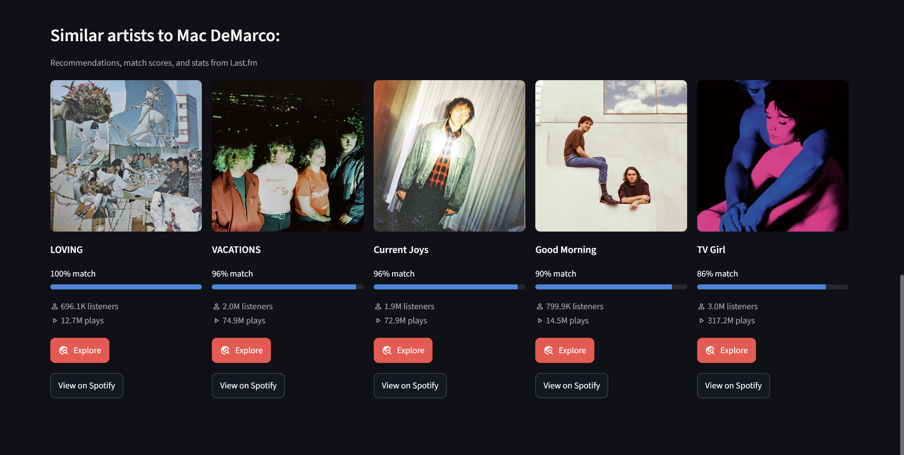
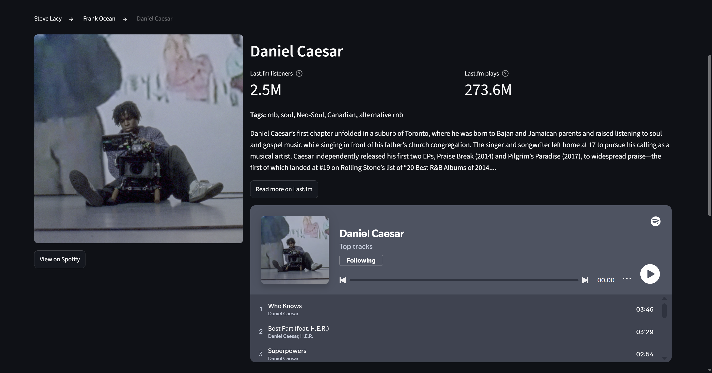

# 🎵 Sonar

**Ping an artist or song to discover what's nearby.**

Sonar is a music discovery app. Search for an artist or a song, and it finds similar music, shows how closely each recommendation matches, and lets you keep exploring from one recommendation to the next.

Built at **ShellHacks 2026**.

**[▶ Try it live: sonar-music.streamlit.app](https://sonar-music.streamlit.app/)**



## Features

- **Artist and song search:** look up any artist or song on Spotify
- **Profiles:** photo or album cover, Last.fm listener and play counts, genre tags, and a short bio
- **Similar music:** five recommendations with a match score showing how similar each one is
- **Discovery rabbit hole:** click **Explore** on any recommendation to make it the new search, with a clickable trail of where you've been (Frank Ocean → Steve Lacy → ...)
- **Listen in the app:** embedded Spotify players for an artist's top songs or a single track



## How it works

Sonar combines two APIs:

- **Spotify Web API:** finds the artist or song you typed, plus images, album info, and Spotify links and players
- **Last.fm API:** provides the similar-artist and similar-song recommendations, match scores, listener and play counts, tags, and bios

Results are cached, so repeat searches load instantly and use fewer API calls.

## Running it locally

1. **Clone the repo:**

   ```bash
   git clone https://github.com/Npena7/shellhacks-music-recommendations.git
   cd shellhacks-music-recommendations
   ```

2. **Create a virtual environment and install the dependencies:**

   ```bash
   python -m venv venv
   venv\Scripts\activate        # Windows
   source venv/bin/activate     # macOS/Linux
   pip install -r requirements.txt
   ```

3. **Add your API keys:** copy `.env.example` to `.env` and fill in your keys:
   - Spotify client ID and secret: create an app in the [Spotify Developer Dashboard](https://developer.spotify.com/dashboard)
   - Last.fm API key: [create an API account](https://www.last.fm/api/account/create)

4. **Run the app:**

   ```bash
   streamlit run app.py
   ```

## Tech stack

- [Python](https://www.python.org/)
- [Streamlit](https://streamlit.io/) for the web interface
- [Spotipy](https://spotipy.readthedocs.io/) for the Spotify Web API
- [Requests](https://requests.readthedocs.io/) for the Last.fm API

## Future ideas

- **"Why you'll like this":** AI-written explanations of what connects each recommendation to your search
- **Vibe search:** describe what you want in plain English ("chill songs for a late-night drive") and get matching music
- **Clickable tags:** explore the top artists for a genre tag like "neo-soul"
- **Journey summary:** turn your exploration trail into a playlist idea

## Credits

Built by [Npena7](https://github.com/Npena7).

Music data from [Last.fm](https://www.last.fm/) and [Spotify](https://www.spotify.com/). Listener and play counts come from Last.fm and are not Spotify stream counts.
